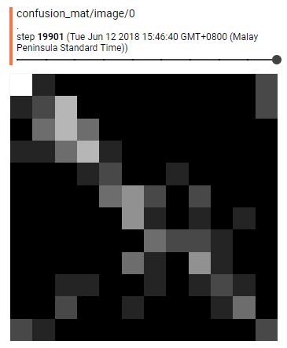

# month_learn looks at satellite precipitation data and guesses the month
## How does splitting the month lead to a potential for overfitting?
The main theory here is that due to the high autocorrelation between rainfall between subsequent days, days adjacent to data in the validation set that are in the training set might lead to overfitting. This overfitting will not be revealed by a simple shuffle-split-train-validate paradigm since the training set and validation set might contain adjacent days. The first goal will thus be to test two different ways to split the data:
1) Shuffle the data before splitting into train/test sets
2) Split the data into train/test sets first, then shuffle
The data is split 60/20/20 into train/test/validate. The validation set is not used in either case (This might be a problem, might want to repeat with 80/20 and use all data). keeping all other hyperparameters the same, two tests are conducted.

### Test 1: Shuffle the data before splitting into train/test sets
Method 1 results in a test accuracy of {'accuracy': 0.37400723, 'global_step': 20000, 'loss': 1.6128341}

### Test 2: Split into train/test sets before shuffling
In progress
