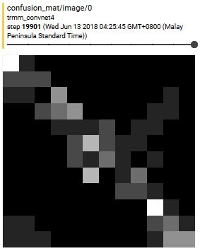
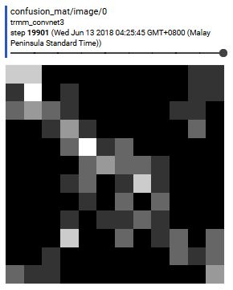
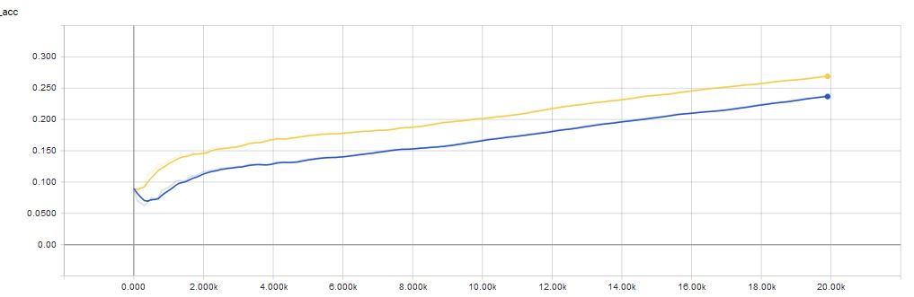

# month_learn looks at satellite precipitation data and guesses the month

The weather at any one time is strongly determined by the season you're in. These seasons are driven changes in the amount of sunlight different parts of the Earth receive due to the angle of the Earth with respect to the Sun. In the tropics, another indicator of season is the distribution of rainfall. As the angle of the Earth relative to the Sun changes, the Inter Tropical Convergence Zone (ITCZ) shifts Northwards (in the summer) and Southwards (in the winter) and rainfall follows. Thus it seems that there should be information on the month of the year encoded in the distribution of rainfall. To see how well this information is encoded in daily rainfall values, we shall test if a convolutional neural network (CNN) is able to predict the month of the year based on the rainfall of any particular day.  

The goal will be to see if the CNN is able to predict the month of the year better than random chance (1/12, or 8.3%).  
## Using this code
The script prep_data.ipynb reads in Tropical Rainfall Measuring Mission data that is in NetCDF format, generates the labels, and saves the data and labels in .npy format as trmm_data.npy and trmm_label.npy.  

The months are encoded as such: 0:January, 1:February, ..., 11:December  

The script month_guess.py contains the whole model, training and evaluation code. The model uses a graph adapted from [this previous project](https://github.com/nickyeolk/minst_cnn). It uses two convolution-maxpooling layers and a fully connected layer of 1024 neurons.
## Data preparation
The data used is gridded precipitation data from [TRMM](https://pmm.nasa.gov/data-access/downloads/trmm). The 3B42 Research Daily Product is used which provides daily rainfall at 0.25° by 0.25° resolution. Prior to use, the dataset is cut to just the Southeast Asian region using [ncks](http://nco.sourceforge.net/): `ncks -d lat,3.17,24.18 -d lon,82.15,124.17 trmm_daily_1998_2016.nc trmm_daily_cut.nc"`. The region was cut mainly due to filesize constrains. Theoretically, using all the data should yield better results.
## How does splitting the month lead to a potential for overfitting?
The theory here is that due to the high autocorrelation between rainfall between subsequent days, days adjacent to data in the validation set that are in the training set might lead to overfitting (Thanks Benjamin). This overfitting will not be revealed by a simple shuffle-split-train-validate paradigm since the training set and validation set might contain adjacent days. The first goal will thus be to test two different ways to split the data:
1) Shuffle the data before splitting into train/test sets
2) Split the data into train/test sets first, then shuffle
The data is split 80/20 into train/test. keeping all other hyperparameters the same, two tests are conducted.

### Test 1: Shuffle the data before splitting into train/test sets
Method 1 results in a test accuracy of {'accuracy': 0.4, 'global_step': 20000, 'loss': 1.573154}

### Test 2: Split into train/test sets before shuffling
Method 2 results in a test accuracy of {'accuracy': 0.3910453, 'global_step': 20000, 'loss': 1.5962765}

### Training accuracy comparison
1) The Yellow line is the accuracy of Test 1 over the 20k learning steps, and 
2) the Blue line is the accuracy of Test 2 over the 20k learning steps.

